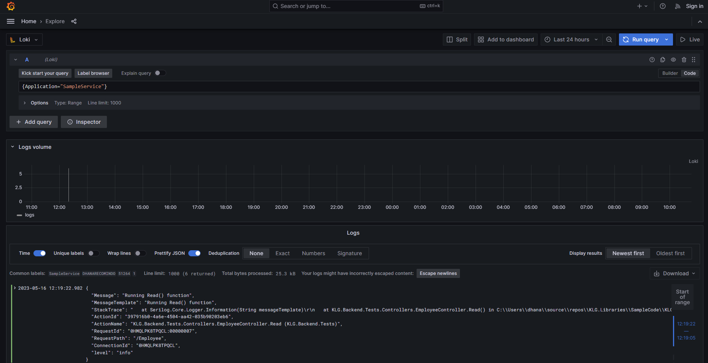

[Home](../../readme.md) >

## F. Logging and Telemetry

Bagian ini membahas tentang pengaturan log dan telemetry pada aplikasi, serta cara menulis dan
menampilkan log data dan telemetry trace. Penggunaan log dan telemetry sangat penting untuk
memantau kinerja aplikasi dan memudahkan proses debugging ketika terjadi masalah.

### <a name="setting"></a>1. Setting log dan telemetry secara manual

Konfigurasi logging dan telemetry akan dilakukan secara otomatis dari Layanan Vault (Vault Service).
Jika Layanan Vault tidak tersedia, sistem akan membaca isi dari file _appsettings.json_.

Properti yang dapat diisi untuk logging adalah:

- LokiEndPoint: merupakan endpoint ingester dari grafana loki
- SeqEndPoint: merupakan endpoint ingester dari datalust seq
- LocalFilePath: merupakan path dari local file untuk menulis log

Contohnya adalah sebagai berikut:

```json
"Logging": {
    "LocalFilePath": "Logs/logs.json",
    "LokiEndpoint": "http://localhost:3100",
    "SeqEndpoint": "http://localhost:5341"
}
```

Dan property yang dapat diisi untuk telemetry adalah:

- OtlpEndpoint: merupakan endpoint untuk menulis ke opentelemetry

Contohnya adalah sebagai berikut:

```json
"Telemetry": {
    "OtlpEndpoint": "http://localhost:4317"
},
```

### <a name="write-to-log"></a>2. Menulis ke log

Secara otomatis, warning dan error sudah tertulis ke dalam log, begitu juga dengan beberapa
informasi seperti eksekusi dari method subscriber. Jika terdapat kebutuhan untuk melakukan 
logging untuk informasi lainnya, dapat dilakukan seperti berikut:

```csharp
Logger.Information("Log suatu informasi");
```

### <a name="write-to-telemetry"></a>3. Menulis ke telemetry


### <a name="show-log"></a>4. Menampilkan log data

Untuk dapat menampilkan log data, anda dapat membuka halaman dari seq atau grafana sesuai dengan
kebutuhan anda. Berikut merupakan contoh tampilan explore dari grafana loki:



### <a name="show-telemetry"></a>5. Menampilkan telemetry trace

